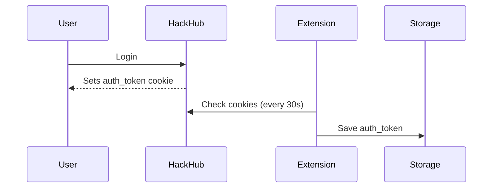
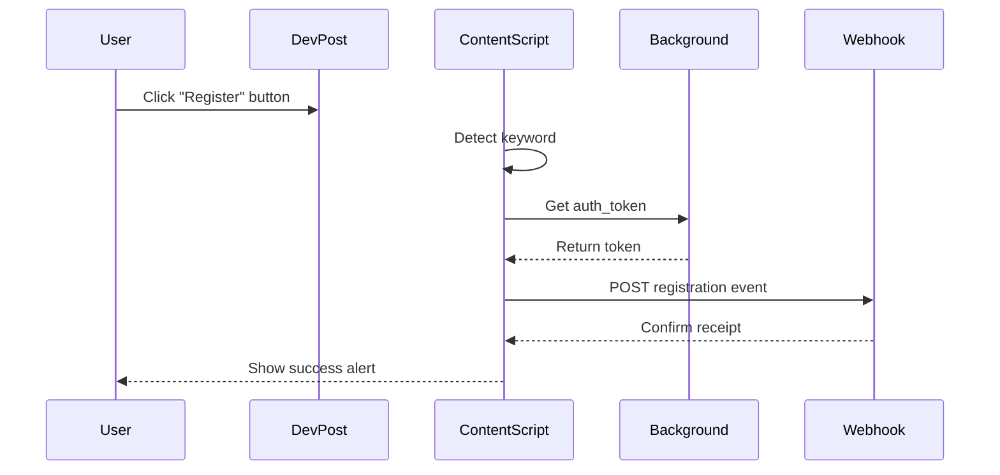

# HackHub Tracker - Chrome Extension

A Manifest V3 Chrome extension that tracks when users click "Register" buttons on external hackathon sites and sends confirmation to your HackHub application.

## 🎯 Features

- **Identity Handshake**: Automatically reads `auth_token` cookie from HackHub domain
- **Smart Detection**: Uses heuristic keyword matching to identify registration buttons
- **Multi-Platform Support**: Works on Devpost, Unstop, Devfolio, HackerRank, and more
- **Event Delegation**: Handles SPAs and dynamically loaded content
- **Webhook Integration**: Sends registration events to your backend API
- **Debug Friendly**: Console logs and browser alerts for easy debugging

## 📁 File Structure

```
hackhub-tracker/
├── manifest.json       # Manifest V3 configuration
├── background.js       # Service worker for auth token management
├── content.js          # Smart scanner for click detection
├── popup.html          # Extension popup UI
├── popup.js            # Popup functionality
└── README.md           # This file
```

## 🚀 Installation

1. **Clone/Download** this extension folder

2. **Add placeholder icons** (required for Chrome):
   - Create `icon16.png`, `icon48.png`, `icon128.png` in the extension folder
   - Or download icons and place them in the folder

3. **Load in Chrome**:
   - Open `chrome://extensions/`
   - Enable "Developer mode" (top right)
   - Click "Load unpacked"
   - Select the `hackhub-tracker` folder

## 🔧 Configuration

### Backend Webhook Endpoint

The extension sends POST requests to:
```
http://localhost:3000/api/extension-webhook
```

**Expected Payload:**
```json
{
  "userToken": "auth_token_from_cookie",
  "currentUrl": "https://devpost.com/hackathons/12345",
  "timestamp": 1701891234567,
  "keyword": "register",
  "elementText": "Register Now",
  "domain": "devpost.com"
}
```

### Your Backend Handler (Example)

```javascript
// api/extension-webhook (Node.js/Express example)
app.post('/api/extension-webhook', async (req, res) => {
  const { userToken, currentUrl, timestamp, keyword } = req.body;
  
  // Verify the token
  const user = await verifyUserToken(userToken);
  
  if (!user) {
    return res.status(401).json({ error: 'Invalid token' });
  }
  
  // Save registration event
  await saveRegistration({
    userId: user.id,
    hackathonUrl: currentUrl,
    registeredAt: new Date(timestamp),
    source: 'extension'
  });
  
  res.json({ success: true, message: 'Registration tracked' });
});
```

## 🎨 How It Works

### 1. Authentication Flow



### 2. Click Detection Flow



## 🔍 Detection Keywords

The extension looks for these keywords in button text:
- `register`
- `apply`
- `sign up` / `signup`
- `join`
- `enroll`
- `participate`
- `attend`

## 🐛 Debugging

### Check Console Logs

Open DevTools on any page and look for:
```
[HackHub Tracker] Content script loaded on: https://devpost.com/...
[HackHub Tracker] Smart Scanner active
[HackHub Tracker] 🎯 Registration button detected!
```

### Check Background Service Worker

1. Go to `chrome://extensions/`
2. Find "HackHub Tracker"
3. Click "service worker" link
4. Look for:
```
[HackHub Tracker] Auth token found: abc123...
[HackHub Tracker] Background service worker initialized
```

### Test Flow

1. **Login to HackHub** at `http://localhost:3000`
2. **Check popup**: Should show auth token (first 8 chars)
3. **Visit hackathon site**: e.g., `https://devpost.com`
4. **Click a registration button**
5. **Check alert**: Should show success message
6. **Check backend**: Verify webhook received the event

## ⚠️ Important Notes

- **Cookie Domain**: The `auth_token` cookie must be accessible to the extension
- **CORS**: Your backend must accept requests from extension origin
- **Cooldown**: Duplicate clicks within 2 seconds are ignored
- **SPA Support**: Uses MutationObserver for dynamic content
- **Permissions**: Extension needs `cookies`, `storage`, `activeTab`, `scripting`

## 🔒 Security Considerations

1. **Token in Storage**: Auth token is stored in `chrome.storage.local` (encrypted by Chrome)
2. **HTTPS Recommended**: Use HTTPS for production (`https://hackhub.com`)
3. **Token Validation**: Backend should always validate the token
4. **Rate Limiting**: Consider adding rate limits to webhook endpoint

## 📝 Customization

### Change Token Cookie Name

In `background.js`:
```javascript
const AUTH_COOKIE_NAME = 'your_cookie_name';
```

### Change Check Interval

In `background.js`:
```javascript
const TOKEN_CHECK_INTERVAL = 60000; // 60 seconds
```

### Add More Keywords

In `content.js`:
```javascript
const REGISTER_KEYWORDS = [
  'register',
  'apply',
  'your_custom_keyword'
];
```

## 📦 Production Deployment

1. Update `manifest.json` domain to production:
```json
"host_permissions": [
  "https://hackhub.com/*"
]
```

2. Update webhook URL in `content.js`:
```javascript
const WEBHOOK_URL = 'https://hackhub.com/api/extension-webhook';
```

3. Create proper extension icons
4. Test thoroughly on all target platforms
5. Package and publish to Chrome Web Store (optional)

## 🛠️ Troubleshooting

### "No auth token found"
- Ensure you're logged in to HackHub
- Check cookie name matches (`auth_token`)
- Verify cookie domain settings

### "Webhook failed"
- Check backend is running on `localhost:3000`
- Verify CORS settings
- Check backend logs for errors

### Extension not detecting clicks
- Open DevTools console for detailed logs
- Verify keyword exists in button text
- Check if site has special button implementations

## 📄 License

This extension is built for HackHub. Modify as needed for your use case.

## 👨‍💻 Support

For issues or questions:
1. Check console logs in DevTools
2. Check service worker logs in `chrome://extensions/`
3. Verify backend webhook endpoint is accessible
4. Review this README for configuration steps
